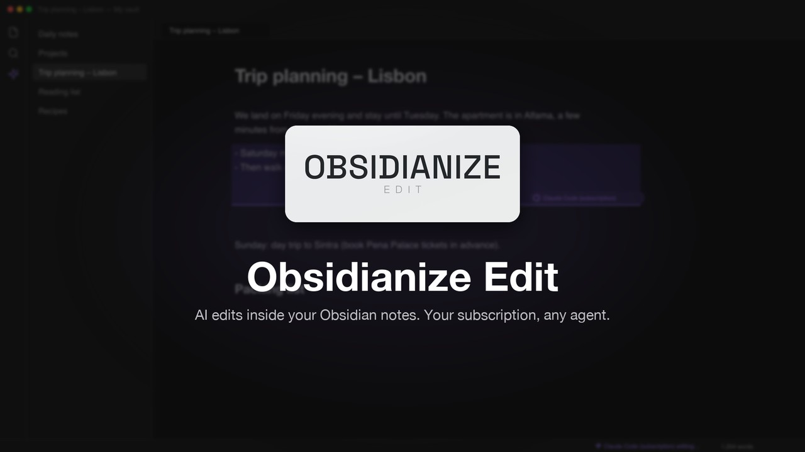
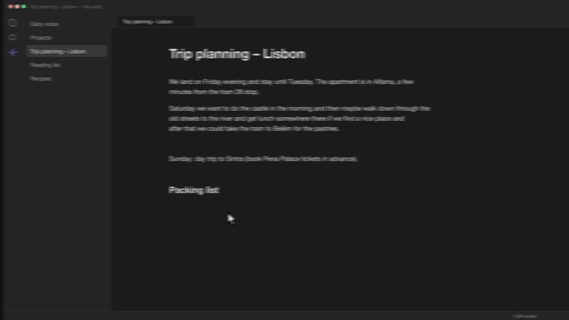
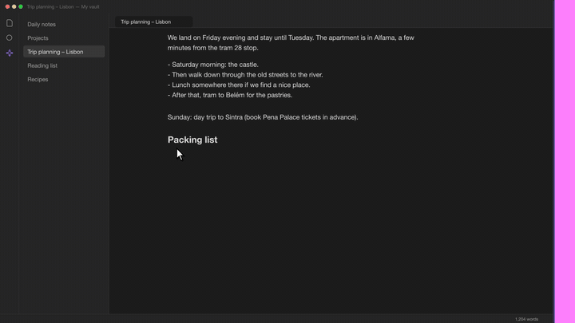

  <picture>
    <source media="(prefers-color-scheme: dark)" srcset="docs/media/logo-small-dark.png">
    
  </picture>

  
  
  
  
  
  

Notekit Edit is an [Obsidian](https://obsidian.md) plugin that turns any passage of a note into a
prompt: select text, say what should change, and the rewrite streams into the note in place. Put the
cursor on an empty line instead and it writes there, using the whole note as context. It runs on the
Claude Pro/Max or ChatGPT subscription you already have (through the Claude Code and Codex CLIs), on an
API key, or on any OpenAI-compatible or ACP agent, including a self-hosted one on another machine.

Made by [pocketcorp](https://pocketcorp.agency).

## Trailer

Watch the [full trailer](docs/media/trailer-preview.mp4) (MP4, 960p preview). 

| Edit a selection | Write at the cursor |
| --- | --- |
|  |  |

## Highlights

- **Edit in place.** Right-click a selection, type an instruction, and the replacement streams into
  the note while the passage is highlighted. One undo step reverts it.
- **Write at the cursor.** With nothing selected, the AI writes new text at the cursor with the full
  note as context.
- **Your subscription, no key required.** The default agent runs the locally installed Claude Code
  CLI and reuses its login. Codex works the same way with the ChatGPT login.
- **Any other agent.** Anthropic or OpenAI API keys, OpenAI-compatible servers (Hermes Agent, Ollama,
  LM Studio, OpenRouter, vLLM), and Agent Client Protocol agents over stdio.
- **Desktop and mobile.** Phones use the bundled bridge to reach a subscription on a computer.
- **Transparent.** A sidebar panel logs every edit with the original text, the exact output, the
  model's reasoning where the agent exposes it, and errors.

## Quick start

1. Install from the community plugin list (search for "Notekit Edit") or download `main.js`,
   `manifest.json` and `styles.css` from the [latest release](https://github.com/pocketcorp-agency/notekit-edit/releases/latest)
   into `<vault>/.obsidian/plugins/notekit-edit/`, then enable the plugin.
2. The setup wizard opens: choose Claude or Codex, then subscription or API key. With a subscription
   there is nothing to enter as long as `claude` (or `codex`) is installed and logged in.
3. Open a note, select some text, right-click and choose **Ask AI to edit selection**.

The full walkthrough is in [docs/getting-started.md](docs/getting-started.md).

## Documentation

| Document | Contents |
| --- | --- |
| [Getting started](docs/getting-started.md) | Installation, the setup wizard, first edit, mobile |
| [Agents](docs/agents.md) | Claude Code, Codex, API keys, ACP agents, OpenAI-compatible servers, Hermes |
| [Bridge](docs/bridge.md) | Using a subscription from a phone or another computer |
| [Usage](docs/usage.md) | Prompt box, cursor mode, the edits panel, commands, settings |
| [Troubleshooting](docs/troubleshooting.md) | Common errors and how to read the edits panel |
| [Architecture](docs/architecture.md) | How the editor extension, backends and bridge fit together |
| [Development](docs/development.md) | Building, tests, lint, project layout |
| [Releasing](docs/releasing.md) | Versioning rules, changelog, tagging, CI/CD |
| [Changelog](CHANGELOG.md) | What changed in each version |

## Requirements

- Obsidian 1.7.2 or newer (desktop and mobile).
- For subscription use on desktop: [Claude Code](https://docs.claude.com/en/docs/claude-code) (`claude`)
  and/or the [Codex CLI](https://developers.openai.com/codex/cli) (`codex`), logged in.
- For mobile subscription use: a computer running the bridge (Node 18 or newer).

## Privacy

Requests go straight from Obsidian to the agent you configured; there is no intermediate service. The
whole note is sent as context. API keys and bridge keys are stored in the vault's
`.obsidian/plugins/notekit-edit/data.json`; exclude that file from syncs you do not trust.

## License

[MIT](LICENSE). Copyright 2026 pocketcorp.
