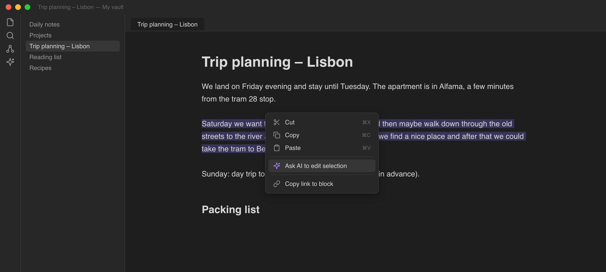
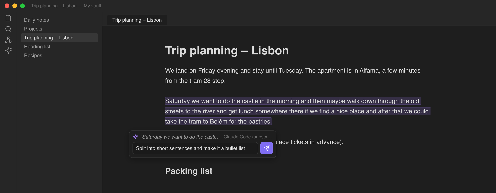
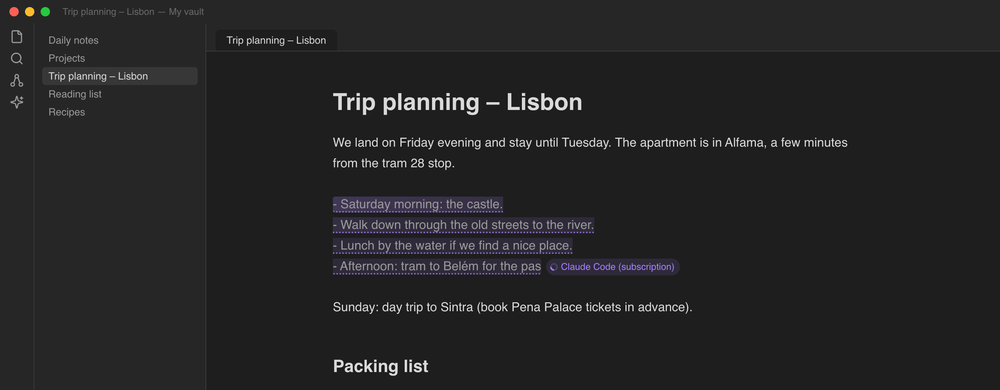
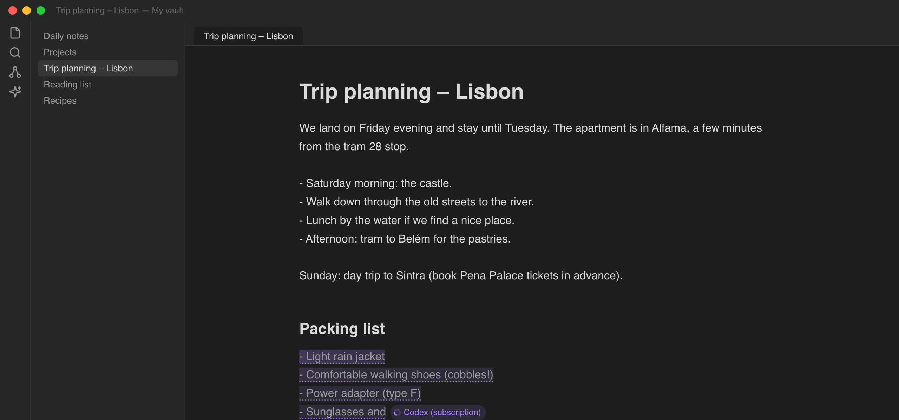
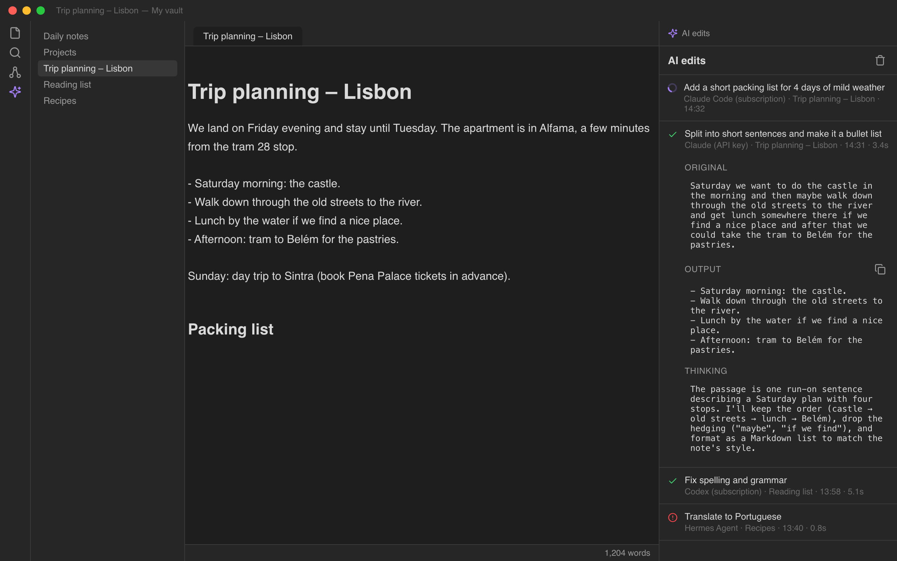
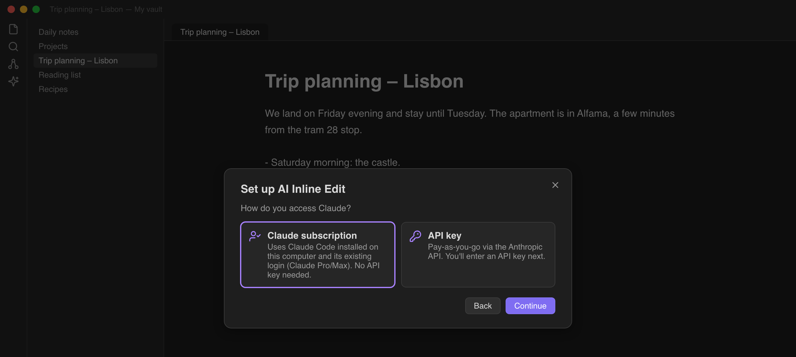

# Usage

## The prompt box

The prompt box opens from the editor context menu (right-click or long-press) or from the command
*Ask AI to edit selection or write at cursor*, which you can bind to a hotkey. It never opens on its
own when you select text.

- With a **selection**, the header shows an excerpt of the selected text and the instruction is
  applied as an edit: the passage is replaced by the agent's output.
- With **no selection**, the header reads "Write at cursor" and the output is inserted at the cursor.
- When more than one agent is configured, a dropdown in the header picks the agent for this request.
  The choice sticks as the default.
- Enter sends, Shift+Enter inserts a newline, Escape closes.

On mobile the box opens as a bottom sheet so it works with the on-screen keyboard.

## What the agent sees

Every request contains the whole note (capped at 150,000 characters before and after the target for
very large notes), the selected text or the cursor position, and your instruction. The system prompt
tells the agent to return only the replacement or the inserted text, to keep Markdown conventions,
and, if the instruction is a question rather than an edit, to answer in a `> [!note] AI` callout
instead of changing the passage.

Add your own standing instructions (style, language, formatting rules) under
Settings > Notekit Edit > Extra instructions.

## While an edit runs

- The target passage is highlighted and a badge with the agent's name sits at its end; in cursor mode
  a pulsing bar marks the insertion point.
- Text streams in as the agent produces it. You can keep editing elsewhere in the note; the tracked
  range follows your edits.
- On success the highlight flashes green and fades. On failure it flashes red, the original text is
  restored, and a notice shows the error.
- Several edits can run at once, in the same or different notes. The desktop status bar shows how
  many are running.
- *Cancel running AI edits* (command palette) aborts everything and restores the original text.

The streamed insertions are collapsed into a single undo step, so Cmd/Ctrl+Z reverts an edit in one go.

## The edits panel

The ribbon icon (or the command *Open AI edits panel*) opens a sidebar listing every edit:

- status (running, done, error, cancelled), instruction, agent, note, time and duration;
- expand an entry to see the **original** text, the exact **output**, the model's **thinking**
  (where the agent exposes it: Anthropic API summarised thinking, Codex reasoning summaries, ACP
  thought chunks, OpenAI-compatible `reasoning_content`) and any error;
- a **Cancel** button on running entries and a copy button on outputs;
- the trash icon clears finished entries.

The last 50 edits persist across restarts. The Claude Code CLI currently does not emit reasoning text,
so its entries show "(none reported by this agent)" under Thinking.

## Ask AI (chat)

Right-click (long-press on mobile) and choose **Ask AI about selection**, or **Ask AI about this
note** when nothing is selected; the command *Ask AI about selection or note* does the same. The
*Ask AI* sidebar opens (the right drawer on mobile) and you can chat with the agent about the passage
or the note.

- The header shows what the chat is about and, with several agents, which agent answers.
- Every question sends the **latest** content of the note, so the agent sees your edits since the
  last question. A selection stays the passage you selected when you opened the chat.
- Answers render as Markdown while they stream in: headings, lists, tables and code blocks with
  syntax highlighting appear as the text arrives, and a blinking bar marks an answer in progress.
- Under each finished answer: **Copy**, **Insert at cursor** (into the note, at the cursor or after
  the selection) and, for a selection, **Replace selection**.
  The note only changes when you click one of these; each is a single undo step. After a
  replacement, the chat is about the new text, so you can refine it further.
- Enter sends, Shift+Enter adds a line; the send button turns into **Stop** while an answer streams.
- The reset button in the header starts over. Asking about another passage or note starts a new
  chat. Chats are not saved.

## Setup links

An `obsidian://notekit-edit?…` link, usually from the QR code the bridge prints, adds or updates an
agent after a confirmation dialog. Settings > Notekit Edit > **Import setup link** takes a pasted link.
See [setup-links.md](setup-links.md).

## Commands

| Command | What it does |
| --- | --- |
| Ask AI to edit selection or write at cursor | Opens the prompt box for the current selection or cursor |
| Ask AI about selection or note | Opens the Ask AI chat for the selection, or the whole note |
| Open AI edits panel | Opens the sidebar log |
| Cancel running AI edits | Aborts all in-flight edits and restores the original text |
| Run setup wizard | Reopens the first-run wizard |

## Settings

| Setting | Default | Notes |
| --- | --- | --- |
| Setup wizard | | Relaunches the wizard; this is how agents are added |
| Agents | Local Claude Code | One card per agent: name, type, connection details, Test button, Set default, Remove. See [agents.md](agents.md) |
| Extra instructions | empty | Appended to the system prompt on every request |
| Max output tokens | 16000 | Upper bound for one reply |

## Screenshots

| | |
| --- | --- |
|  |  |
|  |  |
|  |  |
